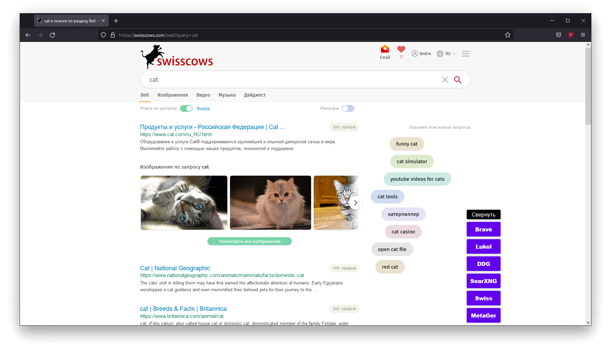
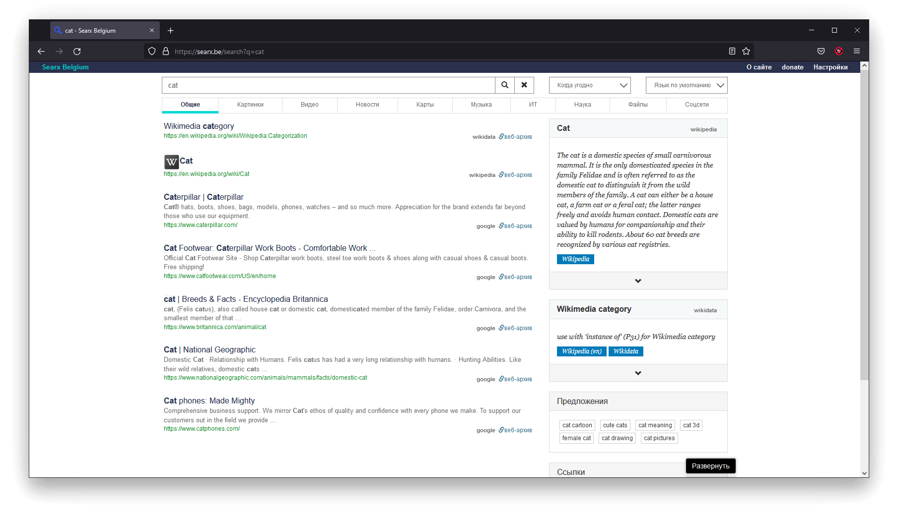

  

  

<h1 align="center">Privacy Redirect (Search) (ex-Answerius)</h1>

Расширение, которое поможет сделать запрос любой информации через поисковики, которые уважают вашу **приватность и анонимность**.

Добавляет кнопки поисковиков, где вы выбираете через какой вы хотите сделать текущий запрос. Расширение считывает запрос и открывает его в выбранном поисковике.

Список поисковиков доступных для использования:

- DuckDuckGo
- Swisscows
- SearXNG
- Lukol
- Brave Search
- MetaGer
<!-- - Peekier (Добавится в будущем) -->
<!-- - Ecosia (Добавится в будущем) -->

Пока не поддерживает такие поисковики как - <b>Peekier</b> и <b>некоторые другие</b>. В них вы просто не увидите кнопки для запроса в другие поисковики.

## Пример использования:

**Нажимаем поисковик, который хотим использовать** 

**Итоговый результат**
