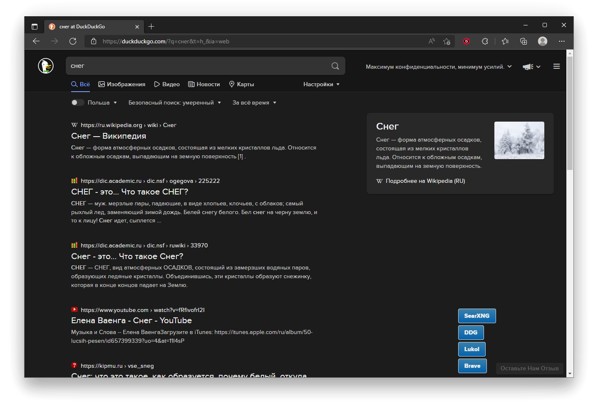
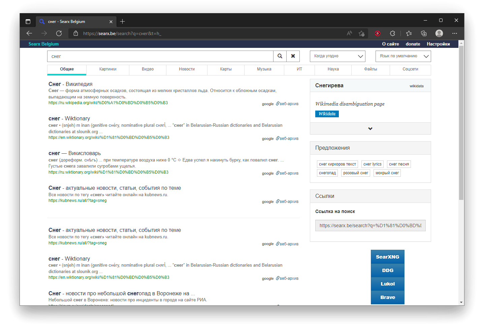

  </img>

<h1 align="center">Answerius</h1>

<b>Search engine</b>

Расширение, которое поможет сделать запрос любой информации через поисковики, которые уважают вашу <b>приватность и анонимность</b>.

Добавляет кнопки поисковиков, где вы выбираете через какой вы хотите сделать текущий запрос. Расширение считывает запрос и открывает его в выбранном поисковике.

Список поисковиков доступных для использования:

<ul>
<li>DuckDuckGo</li>
<!-- <li>Swisscows (Добавится в будущем)</li> -->
<li>SearXNG</li>
<li>Lukol</li>
<li>Brave Search</li>
<!-- <li>Peekier (Добавится в будущем)</li> -->
<!-- <li>Ecosia (Добавится в будущем)</li> -->
</ul>

Пока не поддерживает такие поисковики как - <b>Yandex</b>, <b>Swisscows</b>, <b>Peekier</b> и <b>некоторые другие</b>. В них вы просто не увидите кнопки для запроса в другие поисковики

<h2>Пример использования:</h2>

**Нажимаем поисковик, который хотим использовать** 

**Итоговый результат**

<h2>ToDo</h2>

1. Добавить popup с функцией сокрытия кнопок
2. Добавить кнопку для запроса на странице Yandex
3. Добавить поддержку выдачи ответов из:
  - [ ] Startpage 
  - [ ] SearX 
  - [x] SearXNG 
  - [ ] Qwant
  - [ ] Swisscows
  - [ ] Peekier
  - [ ] Ecosia
  - [ ] Gigablast
